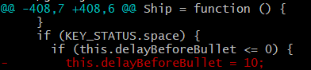

# 과제 3 (난이도 상)

https://github.com/udacity/asteroids 에 들어가 해당 리포지토리를 로컬 머신에 클론 받고 다음 과제를 수행해주세요.

## 버그를 유발한 커밋 찾기

asteroids를 실행하면 우주선과 소행성이 나타납니다. 키보드에서 ←와 →를 누르면 우주선이 가리키는 방향이 바뀌고, ↑를 누르면 우주선이 전진합니다. 스페이스 바를 누르면 로켓이 발사되죠. 

index.html 파일을 열고 게임을 직접 실행해 봅시다.


엇! 그런데 에러가 있네요. 스페이스 바에서 손을 떼지 않고 계속 눌러봅시다. 쉼 없이 총알이 발사됩니다. 


이렇게 끊임없이 총알이 발사되면 게임을 금방 깰 수 있어서 안 됩니다. 처음엔 총알이 끊임없이 발사되지 않도록 구현했었는데, 어디선가 총알이 끊임없이 발사되도록 하는 코드가 들어간 것 같네요.

어떤 커밋때문에 버그가 생겼는지 찾아봅시다. 그리고 버그를 수정하려면 어떻게 해야 하는지 적어봅시다.

### 정답

(여기에 버그를 유발한 커밋의 id와 어떻게 하면 버그를 수정할 수 있는지 적어주세요.)


커밋 id : **25ede836903881848fea811df5b687b59d962da3**

```bash
commit 25ede836903881848fea811df5b687b59d962da3
Author: Doug McInnes <doug@dougmcinnes.com>
Date:   Wed May 26 23:52:00 2010 -0700

    a couple missing ends with the ipad version
```

아이패드 버전 수정을 하면서 411번 째 줄이 삭제되어 총알이 끊임없이 발사되는 문제가 생기게 되었습니다.




따라서 수정하기 위하여 411번째 줄에 아래 코드를 추가하고 다시 게임을 실행해보면 정상적으로 작동하는 것을 확인할 수 있습니다.

```js
this.delayBeforeBullet = 10;
```


### 힌트

과제 2를 통해 커밋도 체크아웃 할 수 있다는 것을 배웠습니다. 이전 커밋을 체크하웃하면 타임머신을 타고 과거로 돌아갈 수 있습니다!
